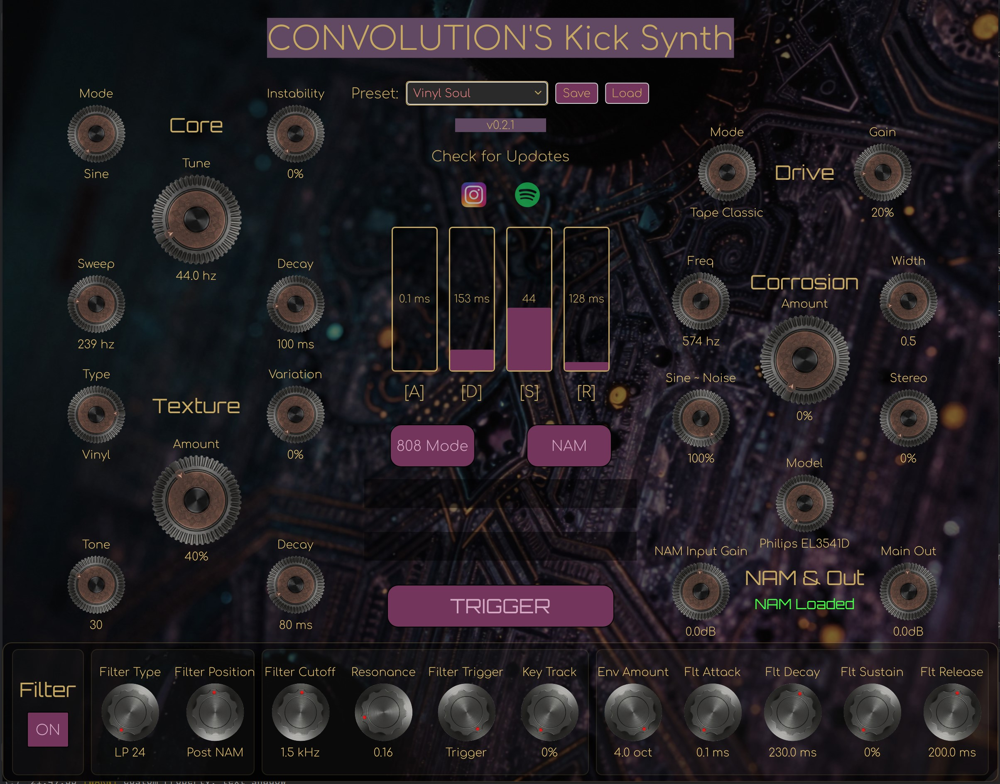

# Convolution's Kick Synth

This is a versatile Kick Drum Synthesizer VST3 plugin built with Rust, `nih-plug`, and `vizia`. It is designed to be a powerful tool for crafting a wide range of kick sounds, from deep and clean 808s to aggressive, textured, and distorted kicks for modern electronic music.



## Features

The synthesizer is organized into four main sections, each controlling a different part of the sound generation process.

### 1. The Source (Generators)

This section is the heart of the kick sound, combining a classic pitch-swept sine wave with a flexible texture layer.

#### **Core (Pitch)**
The fundamental tone of the kick is shaped here.
- **Tune:** Sets the fundamental frequency (the "note") of the kick.
- **Sweep:** Controls the amount of downward pitch envelope. Higher values create a more pronounced "zap" or "click" at the start.
- **Decay:** Determines how long it takes for the pitch to sweep from high to low.
- **Instability:** Introduces subtle, analog-style pitch drift for a less sterile sound.

#### **Texture**
This module adds a secondary layer of sound to the kick, perfect for creating unique character.
- **Amount:** Blends the texture layer with the core sine wave.
- **Type:** Selects from six different texture algorithms:
    1.  **Dust:** A soft, filtered noise, like a dusty record.
    2.  **Crackle:** Simulates the sound of vinyl crackle.
    3.  **Sampled:** A short, looped sample of brown noise.
    4.  **Organic:** A complex, evolving wavetable oscillator.
    5.  **Vinyl:** A mix of hiss and random pops.
    6.  **Zap:** A high-frequency, laser-like FM sound.
- **Tone:** Modifies the timbre of the selected texture (e.g., making it brighter or darker).
- **Decay:** Controls the fade-out time of the texture layer.
- **Variation:** Adds randomness to the texture, making each hit sound slightly different.

### 2. The Body (Amplitude & Control)

This central section shapes the volume contour of the kick and provides master controls.

- **ADSR Envelope:** Standard Attack, Decay, Sustain, and Release sliders for the main amplitude envelope.
- **808 Mode:** When enabled, the **Tune** knob is ignored, and the synth's pitch is determined by incoming MIDI notes, allowing you to play it like a bass synthesizer.
- **NAM Button:** Activates or deactivates the Neural Amp Modeler (NAM) processing stage.
- **Trigger Button:** Manually triggers a kick sound at full velocity.
- **VU Meters:** Provides visual feedback for the left and right output channels.

### 3. The Mangle (Distortion & Effects)

This section is all about adding grit, character, and stereo width.

#### **Drive**
A multi-mode distortion unit.
- **Gain:** Controls the amount of saturation.
- **Mode:** Selects from five distortion models:
    1.  **Tape Classic:** A warm, vintage tape saturation.
    2.  **Tape Modern:** A more aggressive, bright tape sound.
    3.  **Tube Triode:** Soft, even-order harmonic distortion.
    4.  **Tube Pentode:** Harsher, odd-order harmonic distortion.
    5.  **Digital:** A clean, hard-clipping digital distortion.

#### **Corrosion**
An effect inspired by classic "erosion" or "bit-crusher" units, which uses phase-modulated delay lines to create metallic, noisy, or stereo-widening effects.
- **Amount:** The master dry/wet control for the effect.
- **Frequency:** Sets the modulation speed of the delay lines.
- **Width:** Controls the bandwidth of the noise used in the modulation.
- **Sine ~ Noise:** Blends the modulation source between a clean sine wave and filtered noise.
- **Stereo:** Increases the phase difference between the left and right channel modulation, creating a wide stereo effect.

#### **NAM (Neural Amp Modeler)**
A built-in module for processing the sound through pre-trained neural network models of real hardware.
- **Model:** Selects the active NAM model.
- **Input Gain:** Adjusts the level going into the NAM processor.
- **Output Gain:** Trims the level coming out of the NAM processor.

---

## Technical Implementation

- **Framework:** Built on `nih-plug`, a modern, Rust-native framework for creating audio plugins.
- **GUI:** The user interface is rendered using `vizia`, a declarative GUI toolkit for Rust that is part of the `nih-plug` ecosystem.
- **Synthesis:** All DSP (Digital Signal Processing) is written in pure Rust, including the oscillators, envelopes, filters, and distortion algorithms.
- **Signal Flow:**
    1.  A sine oscillator and a texture generator run in parallel.
    2.  Their outputs are summed and processed by the amplitude ADSR envelope.
    3.  The signal is then sent through the multi-mode **Drive** unit.
    4.  (Optional) The signal is processed by the **NAM** module.
    5.  Finally, the signal is passed through the **Corrosion** effect before being sent to the stereo outputs.

---

## Installation Guide

You can download the latest version from the [**Releases Page**](https://github.com/minburg/vst-kick-synth/releases).

### Windows (x64)

1.  Download the `.zip` file for Windows (e.g., `kick_synth-windows-x64.zip`).
2.  Extract the contents of the zip file. You will find a file named `kick_synth.vst3`.
3.  Move the `kick_synth.vst3` file into your VST3 plugins folder. The standard location is:
    ```
    C:\Program Files\Common Files\VST3\
    ```
4.  Rescan for plugins in your Digital Audio Workstation (DAW).

### macOS (Universal: Apple Silicon & Intel)

1.  Download the `.zip` file for macOS (e.g., `kick_synth-macos-universal.zip`).
2.  **Important:** Do **not** double-click to unzip. The standard macOS Archive Utility can sometimes fail to preserve necessary file permissions. Instead, open the **Terminal** app and use the `unzip` command:
    ```bash
    unzip /path/to/your/downloaded/kick_synth-macos-universal.zip
    ```
3.  This will create a `kick_synth.vst3` bundle. A VST3 on macOS is actually a folder that looks like a single file.
4.  Move the `kick_synth.vst3` bundle to your VST3 plugins folder. The standard location is:
    ```
    /Library/Audio/Plug-Ins/VST3/
    ```
    You can access this folder by opening Finder, clicking "Go" in the menu bar, selecting "Go to Folder...", and pasting the path.

#### **Bypassing Gatekeeper (Required for macOS)**
Because the plugin is not officially signed and notarized by Apple, you must manually approve it before your DAW will load it.

1.  After moving the file to the VST3 folder, open the **Terminal** app.
2.  Run the following command to remove the "quarantine" attribute that macOS automatically adds to downloaded files. This tells the system you trust the application.
    ```bash
    sudo xattr -rd com.apple.quarantine /Library/Audio/Plug-Ins/VST3/kick_synth.vst3
    ```
3.  Enter your password when prompted.
4.  Rescan for plugins in your DAW. The kick synth should now appear and load correctly.

---

## Build & Release Workflow

For those interested in the development process, the repository uses GitHub Actions to automate builds.

### Bundle & Zip Handling
Because VST3 plugins are handled differently across operating systems, the workflow applies specific packaging logic to ensure the plugins remain functional after download.

- **Windows (x64):** The Windows build generates a `.vst3` file (essentially a renamed DLL). These are zipped into a standard archive for easy extraction into the `Common Files/VST3` directory.
- **macOS (Universal):** On macOS, a VST3 is a Bundle (a specific directory structure). Direct uploads to GitHub often mangle folder permissions or strip metadata. The workflow uses `zip -ry` to preserve the necessary symbolic links and executable permissions, ensuring the plugin remains loadable.
