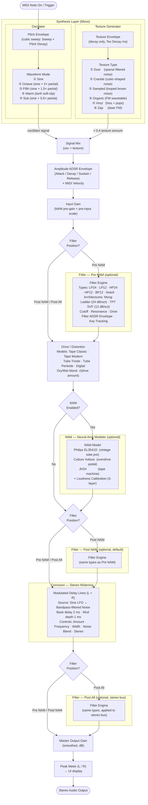

# Audio Processing Flow

```mermaid
flowchart TD
    MIDI([MIDI Note On / Trigger]) --> PITCH_ENV

    subgraph SYNTH["Synthesis Layer (Mono)"]
        direction TB

        subgraph OSC["Oscillator"]
            PITCH_ENV["Pitch Envelope\n(cubic sweep: Sweep × Pitch Decay)"]
            OSC_MODE["Waveform Mode\n① Sine\n② Octave  (sine + 2× partial)\n③ Fifth   (sine + 1.5× partial)\n④ Warm    (tanh soft-clip)\n⑤ Sub     (sine + 0.5× partial)"]
            PITCH_ENV --> OSC_MODE
        end

        subgraph TEX["Texture Generator"]
            TEX_ENV["Texture Envelope\n(decay only, Tex Decay ms)"]
            TEX_TYPE["Texture Type\n① Dust    (sparse filtered noise)\n② Crackle (cubic-shaped noise)\n③ Sampled (looped brown noise)\n④ Organic (FM wavetable)\n⑤ Vinyl   (hiss + pops)\n⑥ Zap     (laser FM)"]
            TEX_ENV --> TEX_TYPE
        end
    end

    OSC_MODE -->|oscillator signal| MIX
    TEX_TYPE -->|× 0.4 texture amount| MIX

    MIX["Signal Mix\n(osc + texture)"]
    MIX --> AMP_ENV

    AMP_ENV["Amplitude ADSR Envelope\n(Attack / Decay / Sustain / Release)\n× MIDI Velocity"]
    AMP_ENV --> INPUT_GAIN

    INPUT_GAIN["Input Gain\n(NAM pre-gain + pre-input scale)"]
    INPUT_GAIN --> FILTER_PRE

    FILTER_PRE{"Filter\nPosition?"}

    FILTER_PRE -->|Pre NAM| FILTER_UNIT_PRE
    FILTER_PRE -->|Post NAM / Post All| DRIVE

    subgraph FILTER_BLOCK_PRE["Filter — Pre NAM (optional)"]
        FILTER_UNIT_PRE["Filter Engine\nTypes: LP24 · LP12 · HP24 · HP12 · BP12 · Notch\nArchitectures: Moog Ladder (24 dB/oct) · TPT SVF (12 dB/oct)\nCutoff · Resonance · Drive\nFilter ADSR Envelope · Key Tracking"]
    end

    FILTER_UNIT_PRE --> DRIVE

    DRIVE["Drive / Distortion\nModels: Tape Classic · Tape Modern\n         Tube Triode · Tube Pentode · Digital\nDry/Wet blend: √(drive amount)"]
    DRIVE --> NAM_CHECK

    NAM_CHECK{"NAM\nEnabled?"}
    NAM_CHECK -->|Yes| NAM
    NAM_CHECK -->|No| FILTER_POST_CHECK

    subgraph NAM_BLOCK["NAM — Neural Amp Modeler (optional)"]
        NAM["NAM Model\nPhilips EL3541D  (vintage tube pre)\nCulture Vulture  (overdrive pedal)\nJH24             (tape machine)\n+ Loudness Calibration (3-layer)"]
    end

    NAM --> FILTER_POST_CHECK

    FILTER_POST_CHECK{"Filter\nPosition?"}
    FILTER_POST_CHECK -->|Post NAM| FILTER_UNIT_POST
    FILTER_POST_CHECK -->|Pre NAM / Post All| CORROSION

    subgraph FILTER_BLOCK_POST["Filter — Post NAM (optional, default)"]
        FILTER_UNIT_POST["Filter Engine\n(same types as Pre NAM)"]
    end

    FILTER_UNIT_POST --> CORROSION

    subgraph CORROSION_BLOCK["Corrosion — Stereo Widening"]
        CORROSION["Modulated Delay Lines (L + R)\nSource: Sine LFO ↔ Bandpass-filtered Noise\nBase delay 2 ms · Mod depth 1 ms\nControls: Amount · Frequency · Width · Noise Blend · Stereo"]
    end

    CORROSION --> FILTER_POST_ALL_CHECK

    FILTER_POST_ALL_CHECK{"Filter\nPosition?"}
    FILTER_POST_ALL_CHECK -->|Post All| FILTER_UNIT_POST_ALL
    FILTER_POST_ALL_CHECK -->|Pre NAM / Post NAM| OUT_GAIN

    subgraph FILTER_BLOCK_POST_ALL["Filter — Post All (optional, stereo bus)"]
        FILTER_UNIT_POST_ALL["Filter Engine\n(same types, applied to stereo bus)"]
    end

    FILTER_UNIT_POST_ALL --> OUT_GAIN

    OUT_GAIN["Master Output Gain\n(smoothed, dB)"]
    OUT_GAIN --> METER

    METER["Peak Meter (L / R)\n→ UI display"]
    METER --> OUTPUT([Stereo Audio Output])
```
